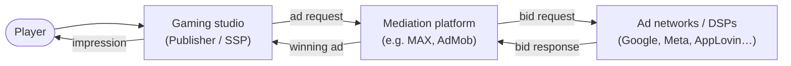
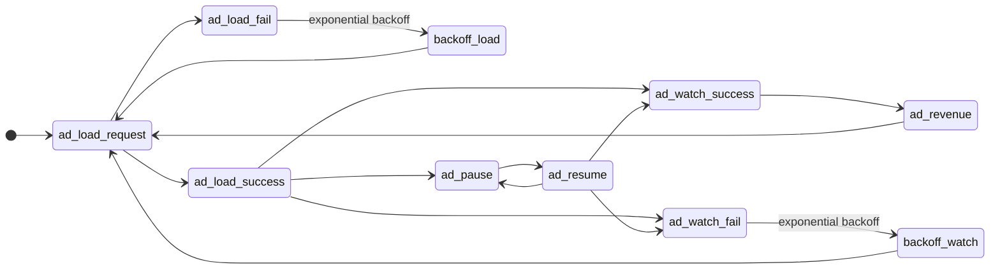

# Core Concepts

Mobile game monetization depends on a chain of systems — your game, a mediation layer, and demand from ad networks — working together in milliseconds every time a player reaches an ad moment. This page gives you the mental model you need before diving into integration, bid floors, or analytics.


**Who this is for:** Game engineers, monetization leads, and product managers who need a shared vocabulary for how ads work in free-to-play games.


---

## What this space covers

| Topic | What you'll learn |
| --- | --- |
| [Glossary](glossary.md) | Definitions for ad units, bid floors, placements, and industry roles |
| [Ad formats](ad-formats.md) | Banner, interstitial, and rewarded video — when to use each |
| [Ad lifecycle](ad-lifecycle.md) | Load → watch → revenue loop, including retries and backoff |
| [Ad metrics](ad-metrics.md) | Delivery, revenue, and auction metrics publishers track daily |

---

## The ecosystem

A free-to-play game does not sell ads directly. It exposes **inventory** — specific moments in gameplay where an ad can appear. A **mediation platform** runs an auction across multiple **ad networks** (demand partners) and returns the highest-paying ad. The game renders it; the network pays the publisher on a successful impression.

### The four roles

| Role | Also called | Responsibility |
| --- | --- | --- |
| **Gaming studio** | Publisher, SSP (Supply-Side Partner) | Owns inventory — the screens and moments where ads can show |
| **Mediation platform** | Mediation SDK / server | Aggregates demand, runs the auction, delivers the winning ad |
| **Ad network** | DSP, Demand-Side Partner | Buys inventory on behalf of advertisers; bids per impression |
| **Ad unit** | — | Configuration object in mediation that defines format, platform, and ID used in game code |

---

## How an auction works

When your game requests an ad, the mediation platform sends **bid requests** to multiple networks. Each network returns a **bid response** with a price. The highest bid wins and the ad is served.

Today, nearly all major mediation platforms use a **first-price auction**: the winner pays exactly what they bid. If three networks bid $1, $2, and $3, the $3 bidder wins and pays $3.


**Bid floor:** The minimum price your game will accept for an impression. If no bid meets the floor, the request goes unfilled. Bid floors can be set per country and are central to revenue optimization.


Older models — **waterfall** (sequential network priority) and **second-price auction** (winner pays $0.01 above the second-highest bid) — are largely deprecated in mobile mediation.

---

## Ad formats at a glance

| Format | Visibility | Player action | Typical use |
| --- | --- | --- | --- |
| **Banner** | Always on screen during play | Passive; easy to ignore | Brand awareness |
| **Interstitial** | Full-screen between levels or loads | Must dismiss after a delay | High visibility; use sparingly |
| **Rewarded video** | Full-screen; player opts in | Watch to completion for in-game reward | Industry standard for F2P monetization |

Other supported formats in mediation systems include **MREC** (medium rectangle) and **native** ads. See [Ad formats](ad-formats.md) for format-level guidance.

---

## The ad lifecycle

Every ad impression follows a repeating cycle in your game code: **load → show → revenue → preload the next ad**. Failures at load or watch time trigger a retry after **exponential backoff**.

Key takeaway: after a successful watch (`ad_watch_success`), revenue is recorded and the next `ad_load_request` starts immediately so the following ad is ready when the player needs it.

Full event definitions and retry behavior are documented in [Ad lifecycle](ad-lifecycle.md).

---

## Metrics that matter

Publishers track three buckets of metrics to understand monetization health:

1. **Delivery** — impressions, ad requests, fill rate, show rate
2. **Revenue** — CPM, eCPM, ARPDAU, ARPU
3. **Auction** — bid requests, win rate, floor price, latency

A filled ad that never shows earns nothing. A high eCPM with low fill rate may underperform a lower eCPM with near-100% fill. See [Ad metrics](ad-metrics.md) for definitions and formulas.

---

## Essential terms

| Term | Definition |
| --- | --- |
| **Impression** | One ad shown on screen |
| **Ad request** | A call from your app to mediation or a network asking for an ad |
| **Fill rate** | Share of requests that return a filled ad |
| **eCPM** | Effective revenue per 1,000 impressions — the standard cross-format comparison metric |
| **Ad placement** | Where in the game the ad appears (e.g. level-complete screen, shop) |
| **Bid floor** | Minimum acceptable price per impression, often set per country |

Full definitions: [Glossary](glossary.md).

---

## What's next


[glossary.md](glossary.md)



[ad-formats.md](ad-formats.md)



[ad-lifecycle.md](ad-lifecycle.md)



[ad-metrics.md](ad-metrics.md)

