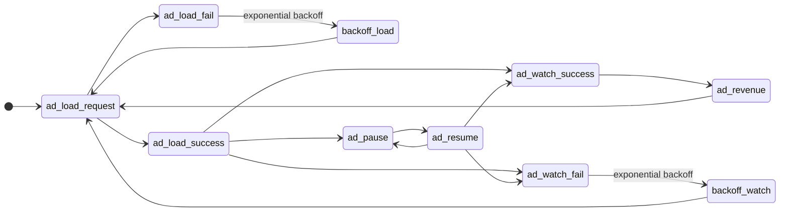

# Ad Lifecycle

A typical ad interval in game code follows a load → watch → revenue loop. Failures trigger retries with exponential backoff. After a successful watch, the next load starts immediately to keep inventory warm.

## State diagram

## Events

| Event | Description |
| --- | --- |
| `ad_load_request` | Game asks mediation for an ad |
| `ad_load_success` | Ad creative is cached and ready to show |
| `ad_load_fail` | No fill or network error during load |
| `ad_pause` | Playback paused (e.g. app backgrounded) |
| `ad_resume` | Playback resumed after pause |
| `ad_watch_success` | User completed the ad (or minimum view threshold met) |
| `ad_watch_fail` | Show failed — creative error, timeout, or early dismiss |
| `ad_revenue` | Impression counted; revenue attributed to the session |

## Flow summary

1. **Load** — `ad_load_request` resolves to `ad_load_success` or `ad_load_fail`.
2. **Load retry** — On `ad_load_fail`, wait with exponential backoff, then retry `ad_load_request`.
3. **Watch** — After `ad_load_success`, the ad can complete (`ad_watch_success`), be interrupted (`ad_pause` / `ad_resume`), or fail (`ad_watch_fail`).
4. **Watch retry** — On `ad_watch_fail`, wait with exponential backoff, then start a new `ad_load_request`.
5. **Revenue & loop** — On `ad_watch_success`, record `ad_revenue`, then immediately initiate the next `ad_load_request` to preload the following ad.
