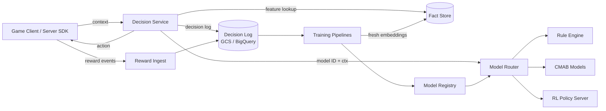
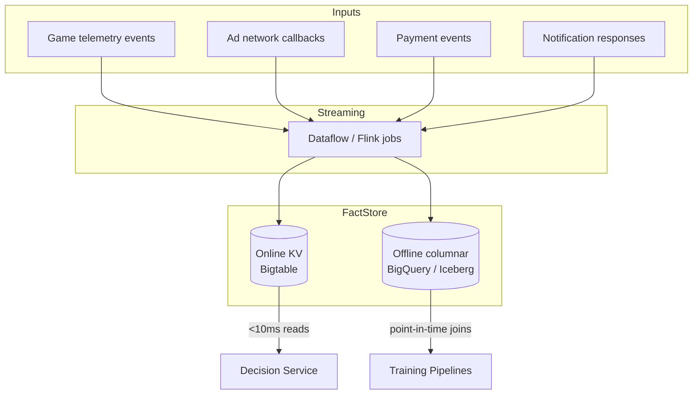
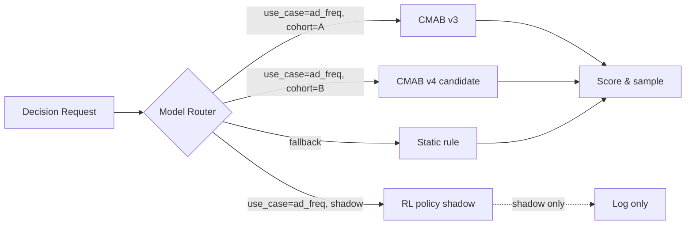
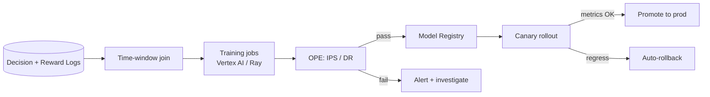

# Game Personalization Platform — Technical Spec

## 1. TL;DR

We are building a **plug-and-play decisioning platform** that lets any game studio register a personalization use case and ship it without standing up an ML team. The platform takes user + game context, picks an action from a configured action set (a bid floor, an ad slot, a notification time, a difficulty tier, an offer), logs the outcome, and continuously improves the policy.

The bet: a single, well-instrumented decisioning loop — fed by a unified player/game fact store — will move retention, monetization, and engagement more reliably than per-game bespoke ML, and at a fraction of the cost.

If this works, it becomes the **default monetization runtime** for every studio on our stack.

---

## 2. Vision

> **One decisioning platform. Any use case. Any studio. Ship in days, not quarters.**

A studio integrates the SDK, defines (a) the context they will send, (b) the action set to choose from, and (c) the reward signal. The platform handles the rest: feature lookup, model selection, action selection, fallback, logging, training, evaluation, and rollout.

Internally, the framework is one decisioning loop. Externally, it manifests as many products: Bid Floor Optimizer, Ad Frequency Optimizer, Notification Timing, Dynamic Difficulty, Offer Personalization, and so on.

---

## 3. Goals

- A **single decisioning framework** that powers heterogeneous personalization use cases across studios.
- A **unified fact store** that stores player embeddings, model scores, and action metadata, computed online and queryable as a low-latency DB at serving time.
- **Tiered algorithm support** — rules → contextual multi-armed bandit (CMAB) → reinforcement learning (RL) — chosen per use case based on data availability, latency budget, and compute cost.
- **Always-on baselines.** Every use case ships with a static fallback policy so degradation of the ML path never takes the game offline.
- **End-to-end logging** of features, action chosen, propensity, and downstream reward — sufficient for offline policy evaluation (OPE) and counterfactual training.
- **Self-serve registration** for new use cases via a config + SDK contract, not a code change in the platform.

## 4. Success Metrics

The platform earns its existence by moving game-level KPIs. We track three layers:

**Business outcomes (per integrated use case)**

- Lift in target metric (ARPDAU, D7 retention, ad eCPM, session length) vs. control, measured via held-out traffic.
- Time-to-launch for a new use case: target **< 1 week** from config to production traffic.
- Number of active use cases × number of studios — the "personalization surface area" we are powering.

**Platform health**

- p99 decision latency: **< 200-500 ms** end-to-end at the SDK boundary.
- Decision-log → training-feature pipeline freshness: **< 1 hour** for online updates, **< 24 hours** for batch.
- Fallback rate (decisions served by static baseline because ML path failed): **< 0.5%** steady-state.

**Modeling quality**

- Off-policy estimated lift vs. logged baseline (IPS / DR estimators).
- Calibration of propensity scores (logged π(a|x) vs. realized frequencies).
- Reward drift detectors firing at expected cadence (signal that monitoring works, not just that nothing is breaking).
---

## 5. Conceptual Model

Every personalization use case on this platform reduces to the same five-tuple:

| Element | What it is | Example (Bid Floor) | Example (Ad Frequency) |
|---|---|---|---|
| **Context `x`** | User + session + game state at decision time | Country, device, LTV bucket, session minute, last-ad-recency | Same as left, plus current ad fill rate, time since last interstitial |
| **Action set `A(x)`** | Discrete (or discretized) options the policy may pick | `{$0.10, $0.25, $0.50, $1.00, $2.00}` floor tiers | `{show_ad, skip_ad, defer_60s, defer_300s}` |
| **Policy `π(a \| x)`** | Mapping from context to a distribution over actions | Rule, CMAB, or RL — chosen per use case | Same |
| **Reward `r`** | Signal we want to improve | eCPM × fill, attributed within session | Net session revenue − churn penalty over next N sessions |
| **Fallback `π₀`** | Always-available static policy | Country-level static floor table | Hard cap of 1 ad / 4 minutes |

If a studio can fill in those five rows for their problem, the platform can serve it. That uniformity is the entire reason this generalizes.

---

## 6. High-Level Architecture



The system has four planes, and they should be reasoned about separately:

1. **Online decisioning plane** — synchronous, p99-bound, must always answer. Decision Service + Fact Store reads + Model Router.
2. **Logging plane** — fire-and-forget writes of `(context, candidate_actions, chosen_action, propensity, model_id, timestamp)` to durable storage, joined later with reward events.
3. **Feature/fact plane** — async writes from streaming jobs, sync point-reads at decision time. Computes player embeddings, recency counters, lifetime aggregates, model scores.
4. **Training & registry plane** — offline batch + scheduled online updates. Reads decision logs + reward joins, produces new model artifacts, publishes to the registry, which the Router picks up.
This four-plane separation is the single most important architectural commitment. Mixing them — e.g., training inside the request path, or relying on synchronously-written features — is what makes per-game ML stacks fragile and unmaintainable.

---

## 7. The Decision Service

The Decision Service is the only thing the SDK talks to. Its job is narrow and well-defined:

```
decide(use_case_id, user_id, request_context) -> {action, decision_id, fallback_used}
```

Internally it does, in order:

1. **Resolve use-case config** from a hot-loaded registry (action set, candidate models, fallback policy, latency budget, exploration rate).
2. **Hydrate features**: parallel point-lookups against the Fact Store keyed by `user_id` and `game_id`, merged with the request-time context.
3. **Route to a model**: the Model Router decides *which* policy serves this request — based on use-case config, A/B assignment, model health, and shadow-mode flags.
4. **Score candidate actions** under the chosen policy, sample (or argmax with ε-exploration) to pick `a`.
5. **Apply guardrails**: business rules that veto the model's choice (e.g., never show an ad in the first 60s of a new install).
6. **Emit decision log** asynchronously — never block the response on logging.
7. **Return the action** with a `decision_id` the SDK will echo back on the reward event.
**Latency budget** (p99 target, 200-500 ms total at SDK boundary):

| Step | Budget |
|---|---|
| Network in/out (regional) | ~200 ms |
| Feature hydration (parallel reads) | ~50 ms |
| Model scoring | ~50 ms (rules/CMAB), up to ~50 ms (small RL nets) |
| Guardrails + serialization | ~15 ms |
| Headroom | ~20 ms |

**Critical property: graceful degradation.** Any failure — Fact Store timeout, model registry stale, scoring exception — falls back to the static `π₀` for that use case. We log the fallback reason, count it against the SLO, and never fail the SDK call.

---

## 8. The Fact Store

The Fact Store is the unified substrate. It is **not** a generic feature store off-the-shelf — it is purpose-built for decisioning workloads. Inspired heavily by Netflix's ML Fact Store, with two non-negotiable properties:

1. **Online-computed, offline-readable.** Features are computed by streaming jobs as events arrive, written to a low-latency KV (Bigtable / Spanner / equivalent) for serving, *and* mirrored to columnar storage (BigQuery / Iceberg) for training.
2. **Time-travelable.** Every feature has a write timestamp. At training time, we can reconstruct the *exact* feature vector that the model saw at decision time, eliminating train-serve skew.
### 8.1 What lives in the Fact Store



Five categories of facts:

- **Player embeddings** — dense vectors learned from behavior sequences (sessions, purchases, ad interactions). Refreshed daily; the embedding *as of* decision time is what gets logged.
- **Player aggregates** — counters and windowed stats: lifetime sessions, last 24h ad views, last 7d spend, days since last login. Updated in streaming.
- **Game state aggregates** — per-game eCPM rolling means, fill rates, current LiveOps tier, content cohort.
- **Action metadata** — what's in the action set right now, plus per-action features (creative type, advertiser tier for ad slots, floor amount for bid floors).
- **Model scores** — pre-computed scores for expensive models, cached with TTL. Lets the decision path stay fast even when underlying models are heavy (e.g., transformer-based player encoders).
### 8.2 Time travel for training

Distributed time-travel pattern: at training time, instead of recomputing features from raw events (slow, expensive, train-serve-skew prone), we replay the **logged feature snapshot** that the decision service actually saw. The decision log carries either the inline feature vector or pointers + timestamps for reconstruction. Either way, training gets exactly what serving got.

This is the single most important property for off-policy correctness. If the trained policy thinks the world looked different from what the logging policy saw, IPS and DR estimators are biased and we will ship regressions confidently.

---

## 9. The Model Router



The Router is what makes this a *platform* and not a collection of bespoke services:

- **Use-case → model artifact** mapping, hot-reloadable from the registry.
- **Traffic splitting** — A/B/n, canary %, shadow mode, ramp schedules.
- **Health gating** — if a model's serving error rate or latency p99 crosses a threshold, the Router automatically drains traffic to the fallback. No human in the loop.
- **Multi-armed routing** — for use cases where we genuinely don't know which model is best, the Router itself can run a meta-bandit over models. Use sparingly; mostly a safety valve.
The Router is also where we enforce **isolation**: a runaway model in studio X's Ad Frequency use case cannot consume CPU budget from studio Y's Bid Floor use case. Each use case has its own pool, its own SLO, its own kill switch.

---

## 11. Algorithm Tiers

We explicitly support three tiers per use case, and the choice is driven by data availability and reward-signal characteristics — not by ML team preference.

| Tier | When to use | Pros | Cons |
|---|---|---|---|
| **Rules / heuristic** | Day 0 of any new use case, or low-traffic studios where statistical power is weak | Trivially explainable, instant ship, no training loop needed | Cannot personalize; ceiling is whatever the human encoded |
| **Contextual MAB (LinUCB, Thompson, neural CMAB)** | Reward is observable within a session; action space is small (≤ ~50); context is a flat feature vector | Strong sample efficiency, well-understood OPE, low compute | Cannot reason about long-horizon reward (e.g., D7 retention impact of a difficulty choice today) |
| **RL (offline RL — CQL, IQL — or online with safety constraints)** | Long-horizon reward, sequential decisions matter, sufficient logged data with good propensities | Optimizes the metric we actually care about (lifetime value, not session value) | Demanding on logging quality, harder to evaluate offline, slower iteration |

**Default escalation path:** every new use case ships first as rules, then graduates to CMAB once we have ≥ ~2 weeks of clean logged data with propensities, then optionally to RL once the long-horizon reward signal proves more important than session-local reward.

This is deliberately conservative. Most use cases will plateau at well-tuned CMAB and that is fine — RL is only justified when the math says session-local reward is leaving meaningful long-term reward on the table.

---

## 12. Logging & Off-Policy Evaluation

Every decision emits a structured log record. This is the single most important artifact the platform produces — without it, training is biased and evaluation is fiction.

```json
{
  "decision_id": "uuid",
  "timestamp": "2026-05-05T10:00:00Z",
  "use_case_id": "ad_frequency_v1",
  "studio_id": "studio_42",
  "user_id": "hashed_user_id",
  "model_id": "ad_freq_cmab_v7",
  "model_version": "2026.04.28",
  "context_features": {...},          // or pointer + ts
  "candidate_actions": ["show","skip","defer_60","defer_300"],
  "scores": [0.42, 0.18, 0.27, 0.13],
  "chosen_action": "show",
  "propensity": 0.42,                  // P(chosen | x) under logging policy
  "exploration_strategy": "thompson",
  "fallback_used": false,
  "guardrails_triggered": []
}
```

The reward join happens offline: the SDK posts reward events with the originating `decision_id`, a streaming job stitches `decision_log ⋈ reward_log` with appropriate windowing per use case, and the joined table is the input to both training and OPE.

**OPE pipeline.** Before any model is promoted, we run inverse propensity scoring (IPS) and doubly-robust (DR) estimators against held-out logged data. A candidate model only graduates from shadow → canary if its DR-estimated lift over the production policy is positive with confidence interval clear of zero. This is the gate that prevents "model trains well, ships, regresses revenue."

---

## 13. Training & Continuous Learning



Cadence:

- **CMAB models:** retrained every 6 hours (or sooner on data volume triggers). Most use cases will sit here.
- **RL policies:** retrained nightly via offline RL on a rolling window of logged data.
- **Player embedding models:** retrained weekly; embeddings refreshed daily.
- **Rule baselines:** updated only on human review, version-controlled.
All training runs are reproducible from `(code SHA, data snapshot, config)`. Model artifacts are immutable and addressable in the registry.

---

## 14. Reference Use Cases

These two are the v1 launch use cases. They share 95% of the platform; the deltas illustrate exactly what registering a *new* use case looks like.

### 14.1 Bid Floor Optimization

**Why it matters.** Static country-level bid floors leave money on the table for high-value users (floor too low → underpriced impressions) and lose impressions on low-value users (floor too high → no fill). Personalizing the floor directly moves eCPM × fill, and the reward signal is observable within the same session.

| Element | Definition |
|---|---|
| Context `x` | Country, device tier, app version, hour-of-day, last-7d ad eCPM for user, session minute, recent fill rate, player embedding |
| Action set `A` | Discrete floor tiers: `[$0.05, $0.10, $0.25, $0.50, $1.00, $2.00, $5.00]` (per ad unit type) |
| Policy `π` | **v1: Thompson-sampling CMAB** with linear scoring per action; **v2: neural CMAB** once embeddings stabilize |
| Reward `r` | Realized revenue from the impression (eCPM × served), zero on no-fill, attributed within a 60s window |
| Fallback `π₀` | Country × device × ad-unit static floor table, refreshed weekly from offline analysis |

The action space is naturally discrete and small; CMAB is the right fit. The reward is fast (seconds, not days) so we can retrain frequently. The big risk is **propensity collapse** — if the policy gets too confident too fast, exploration dies and we stop learning. Thompson sampling is chosen specifically because it preserves exploration without an explicit ε schedule.

### 14.2 Ad Frequency / Placement

**Why it matters.** Showing too many ads tanks retention; showing too few tanks revenue. The optimal frequency varies massively by user — whales tolerate fewer ads but spend; casual users tolerate more. A static "1 ad per 3 minutes" rule is universally wrong.

| Element | Definition |
|---|---|
| Context `x` | Same as Bid Floor + time-since-last-ad, ads-this-session, session length so far, recent IAP behavior |
| Action set `A` | `{show_now, skip, defer_60s, defer_300s}` plus a placement choice when `show_now` is picked |
| Policy `π` | **v1: CMAB** on session-local reward; **v2: offline RL (IQL)** on net-session-revenue minus churn-penalty |
| Reward `r` | Net session revenue (ads + IAP) − weighted next-session churn penalty (long-horizon) |
| Fallback `π₀` | Hard cap of 1 ad per 4 minutes, no ad in first 60s, no ad mid-payment-flow |

This is the use case where CMAB → RL graduation actually pays. The "show this ad now" action might earn revenue immediately but cost a session next week. CMAB cannot see that; offline RL with a properly defined long-horizon reward can. We will ship CMAB first, log meticulously, and graduate to offline RL once we have ≥ 4 weeks of logged data with reliable propensities.

### 14.3 Future Use Cases (preview)

Same five-tuple template. Each is a config + reward definition, not a new system:

- **Notification timing:** action = send-time bucket; reward = open + downstream session.
- **Dynamic difficulty:** action = difficulty modifier on next level; reward = D1/D7 retention conditioned on completion.
- **Offer personalization:** action = which offer to show; reward = conversion + revenue net of cannibalization.
- **Tutorial path:** action = next tutorial step variant; reward = onboarding completion + D3 retention.
---

## 15. SDK & Studio Integration Surface

What a studio actually does to ship a new use case:

1. **Register the use case** via a YAML config (action set, context schema, reward definition, fallback policy, latency budget). Reviewed by platform team in v1; self-serve in v2.
2. **Integrate the SDK** — one call: `platform.decide(use_case_id, user_id, context) -> action`.
3. **Wire the reward event** — call `platform.report_reward(decision_id, reward_value)` when the outcome is observed.
4. **Watch the dashboard** — auto-generated per use case: traffic, fallback rate, action distribution, reward over time, A/B vs. baseline.
Day 0, the action returned is the static fallback. As soon as ~10K decisions are logged with rewards joined, the platform automatically starts training a CMAB and the Router shadow-deploys it. Once OPE clears, it graduates to canary, then production. **The studio writes zero ML code.**

---